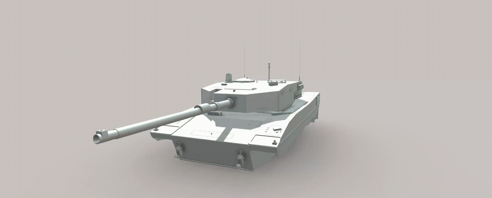

## Leopard 2AV — 3D Model (Work in Progress)

This is a full-scale 3D model of the Leopard 2AV main battle tank, currently a work in progress.

The model was created in КОМПАС-3D, an engineering-oriented CAD software rather than a traditional 3D art tool like Blender.

---

## 3D Model Viewer

Live demo: [Open website](https://nskbogdanl.github.io/Leopard-2AV-3D-Model/)

---

## Wait a little to see a gif:

---

## Current Focus

The focus so far has been on the hull and turret geometry.

Despite the limitations, the model already features a relatively high level of detail across:
- Hull
- Turret
- External components

---

## Problems

- Some structural inaccuracies are present  
- Certain parts may appear slightly uneven or rough  

These issues are mainly due to the fact that the project was started while I was still learning the software and was not originally intended to reach this level of detail.

As the project evolved, the scope increased, which led to inconsistencies between earlier and newer parts of the model.

---

## Missing Components

- The running gear (tracks and road wheels) is currently not modeled  
- This is due to:
  - High complexity of accurate reconstruction  
  - Limited availability of reliable reference blueprints  
